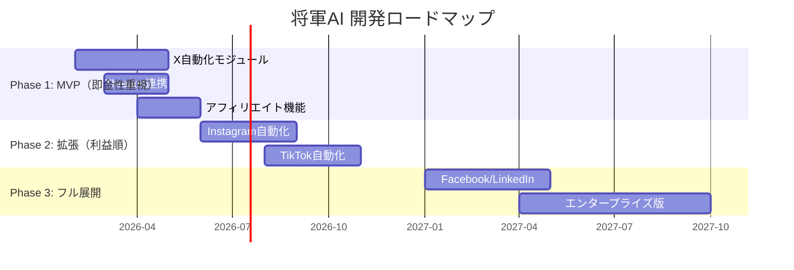

# 経営事業計画書：AIグロースインフラ構築デザイナー（SYOGUN AI）— 100億円到達計画

**作成日**: 2026年2月12日（2026年2月13日更新）
**作成者**: 織田
**計画期間**: 2026年2月 〜 2029年2月（3カ年計画）
**最終目標**: 売上高100億円 / 営業利益率40%以上

---

> [!IMPORTANT]
> **コンサルは「口だけ」。代行は「手だけ」。だから統合する。**
> 本計画は「AIグロースインフラ構築デザイナー（SYOGUN AI）」を中核事業とし、戦略（脳）と実行（手）を一体化した**ハイブリッド型事業実装モデル**で100億円を2〜3年以内に達成するための戦略書である。
> 「思想 × テクノロジー × 仕組み」の三位一体で、クライアントの事業に直接「武器」と「導線」を構築し、「時間を売る」ビジネスから「システムを売る」ビジネスへの完全移行を果たす。

---

## 第1章：エグゼクティブサマリー

### ミッション
 **「AIで労働から解放し、思考を高め、仲間と共に衣食住を満たす"現代型経済圏"を創る」**
 
### What（何をやるのか）
**「AIグロースインフラ構築デザイナー」として、クライアントの事業に戦略設計からAIインフラ構築・運用までを一気通貫で「実装（Implementation）」する。コンサルだけの口先サービスでも、言われたことだけやる作業代行でもない。**クライアントの事業に脳みそと手を突っ込み、勝てるシステムを直接構築する** ハイブリッド型モデルである。

中核プロダクト「SYOGUN AI」は、SNS運用の80%をAIで自動化する統合プラットフォームであり、このインフラを「資産」としてクライアントに納品する。Serge Gatariが提唱する「代理店を売るのではなくインフラを売れ」の日本版進化形。

### Why Now（なぜ今か）
- AI自動化コストが劇的に低下（GPT-4クラスが1/10以下のコストで利用可能）
- 日本市場ではSNS自動化SaaSの本格的プレイヤーが不在
- $r > g$ の加速により「AIインフラを持つ者」と「持たない者」の格差が拡大中
- 既存の「教会モデル（オンラインサロン）」の限界が露呈し、ユーザーが「武器（ツール）」を求め始めている

### 100億円への道筋（概要）

| フェーズ | 期間 | 売上目標 | 主な収益源 |
|:---:|:---:|:---:|:---|
| **Phase 1: 征服** | 2026年2月〜2026年12月 | **8億〜12億円** | AIグロースインフラ構築（高単価実装） + JV + コンテンツ販売 |
| **Phase 2: 拡張** | 2027年1月〜2027年12月 | **25億〜35億円** | SaaS本格展開 + インフラ実装スケール + JV拡大 |
| **Phase 3: 天下統一** | 2028年1月〜2029年2月 | **55億〜70億円** | プラットフォーム収益 + エンタープライズ + 海外展開 |

**累計3年間合計: 88億〜117億円（中間値100億円）**

---

## 第2章：現状分析と課題

### 2.1 現在の事業基盤

| 項目 | 現状 |
|:---|:---|
| **主な収益** | オンラインコンサル運営、事業実装パートナー（コンサル×代行ハイブリッド）、JV |
| **月間売上** | 180万〜250万円（2026年2月時点） |
| **過去最高実績** | JVで短期間数千万利益 / 月収500万超え / Brain数百部販売 |
| **チーム** | 織田 + ひろき + たけし + 3名（計6名） |
| **SNS資産** | X毎日1000imp〜50万imp（不安定）/ Claude Code活用で複数アカウント運用可 |
| **プロダクト構想** | SYOGUN AI — SNS自動化SaaS + AIグロースインフラ構築 |
| **既存リスト** | 織田・たけし・そうたくんのリスト2,000人の活用可能 |
| **既存LP** | [事業実装パートナー募集LP](file:///Users/od/2nd-Brain/04_アウトプット/事業実装パートナー_募集LP案.md) + [ヒアリングシート](file:///Users/od/2nd-Brain/04_アウトプット/事業実装パートナー_ヒアリングシート案.md) 作成済み |
| **既存コンテンツ資産** | 9個の購入コンテンツからノウハウ抽出済み（6教育FW、ローンチ戦略、セールス術等）|

### 2.2 クリティカルな課題（深刻度順）

```
🔴 致命的（即時対応が必要）
├── ファネルが未構築 → 集客〜成約の導線がない
├── セールス人材の不足 → 高単価を決められる人間が2人（成約率30%~40%）しかいない
└── 毎月の安定収益がない → サブスク/リカーリング収益ゼロ

🟡 重要（3ヶ月以内に解決）
├── impが安定しない → コンテンツ品質と頻度のバラつき
├── 営業に時間を取られている → 織田の時間がボトルネック
└── SaaSの保守・運用・セキュリティ設計が未定
```

### 2.3 強みの棚卸し（最大の武器）

| 強み | レバレッジ方法 |
|:---|:---|
| AIプロンプトエンジニアリング力 | → SaaSのコア技術 + クライアントへの即時価値提供に直結 |
| 思想 × キャラクター × 構造の三位一体 | → 他社が模倣不能なブランド |
| JV実績（短期間で数千万） | → 即金性の高いキャッシュエンジン |
| 「武器商人」ポジショニング | → 教会でも機械でもない独自ポジション |
| **事業実装パートナー**の概念確立 | → コンサル×代行を統合した新カテゴリ（LP/ヒアリングシート作成済み） |
| コンテンツ販売ノウハウ × ローンチ戦略 | → 高単価 × 限定性で爆発的売上（9コンテンツ分のノウハウ体系化済み） |
| 将軍POSTメソッド | → コンテンツの型が体系化（6教育FW、3Daysローンチ、ZOOMセールス術） |
| Xリスト集客の実証済みモデル | → [スクール業向けロードマップ](file:///Users/od/2nd-Brain/04_アウトプット/X記事/31_スクール業向け_Xリスト集客完全ロードマップ_v3.md)で1週間127リスト獲得の成功パターン |

---

## 第3章：市場分析

### 3.1 TAM / SAM / SOM

```
TAM（Total Addressable Market）：SNSマーケティングツール世界市場
  → 2026年時点: 約4兆円（CAGR 25%）

SAM（Serviceable Available Market）：日本の個人・中小向けSNS自動化ツール
  → 約3,000億円

SOM（Serviceable Obtainable Market）：3年以内に獲得可能な市場
  → 約300億円（うちシェア33% = 100億円）
```

### 3.2 競合分析マトリクス

| 競合タイプ | 代表例 | 強み | 弱み | 将軍AIの優位性 |
|:---|:---|:---|:---|:---|
| 海外SaaS | Buffer / Hootsuite | 機能豊富・グローバル | 日本語対応弱い / 高額 | 日本市場特化 + AI生成 |
| 国内ツール | SocialDog | 日本語対応 | 自動化弱い / 分析のみ | 投稿〜添削まで一気通貫 |
| 教会モデル | オンラインサロン | コミュニティ力 | スケール限界 / 依存型 | ツールとして自立促進 |
| 代行会社 | SNS運用代行 | 丸投げ可能 | 高コスト / 属人的 | AIで80%コスト削減 |

### 3.3 市場の空白地帯（ブルーオーシャン）

```
               ┌─────────────────────────────────┐
  高技術力      │  海外SaaS（Buffer等）             │
               │  → 日本市場で弱い                  │
               ├─────────────────────────────────┤
               │  ★将軍AI（syougnAI）              │
               │  → AIネイティブ × 日本特化          │
               │  → 「武器」としてのポジショニング     │
               ├─────────────────────────────────┤
  低技術力      │  オンラインサロン / 代行会社         │
               │  → 属人的 / スケール不可            │
               └─────────────────────────────────┘
               低単価 ──────────────────── 高単価
```

---

## 第4章：プロダクト戦略 — SYOGUN AI

### 4.1 プロダクトビジョン

> **「お前の事業に、俺の脳みそと手を突っ込む」**

SYOGUN AIは「ツール」であり「事業実装サービス」でもある。X、Instagram、Threads、TikTok、Facebook、LinkedInの全プラットフォームを横断し、**戦略設計 → インフラ構築 → 投稿自動化 → 分析 → 添削**までを一気通貫で提供。

**提供の3フェーズ（事業実装パートナーLPより）:**
1. **戦略フェーズ**: 誰に、何を、どう売るか。「武器商人」の全知識で設計
2. **構築フェーズ**: LP、ステップメール、SNS運用フロー。AIを駆使して最速で形に
3. **運用フェーズ**: 実際に回し、数字を見て、即座に修正

### 4.2 開発ロードマップ（優先度順）



### 4.3 コア機能一覧

| 機能 | 説明 | 80%削減のインパクト |
|:---|:---|:---|
| **AI投稿生成** | キャラクター設定に基づく自動投稿生成 | 毎日30分→5分 |
| **クロスプラットフォーム投稿** | 1ソースから全SNSへ最適化配信 | 6回の作業→1回 |
| **分析ダッシュボード** | エンゲージメント・成長分析 | 週1時間→自動 |
| **添削AI** | 投稿前の自動チェック・改善提案 | 感覚→データドリブン |
| **キャラクターフィルタリング** | ペルソナ別の投稿スタイル切替 | 複数アカ運用を効率化 |
| **ファネルビルダー** | IMP→エンゲージ→リード→成約の自動構築 | ゼロ知識でもファネル構築 |
| **スケジューラー** | 最適時間帯の自動投稿 | 手動投稿の完全廃止 |

### 4.4 テクノロジースタック（Shadow Stack）

| レイヤー | 技術 | 選定理由 |
|:---|:---|:---|
| AI基盤 | Claude API / Local LLM | コスト最適化 + 検閲回避 |
| 自動化 | n8n (Self-hosted) | ローコード + データ漏洩リスク低減 |
| CRM/ファネル | GoHighLevel (OEM) | Snapshort販売モデルの中核 |
| フロントエンド | Next.js / React | モダンUI |
| インフラ | AWS / Vercel | スケーラビリティ |
| 決済 | Stripe / UTAGE | サブスク課金 |

---

## 第5章：収益モデル — 3つのキャッシュエンジン

### 5.1 収益構造の全体像

> [!TIP]
> コンサルと代行は分離しない。「戦略設計 → AIインフラ構築 → 運用」を一体で提供する「AIグロースインフラ構築デザイナー」が中核エンジン。

```
                    ┌──────────────────────┐
                    │    100億円の売上構成    │
                    └──────────────────────┘
                              │
          ┌───────────┬───────┴────────┬───────────┐
          ▼                  ▼                  ▼
     ┌────────────┐ ┌────────────┐ ┌────────────┐
     │Engine 1    │ │Engine 2    │ │Engine 3    │
     │AIグロース    │ │SaaS       │ │JV+        │
     │インフラ構築  │ │サブスク    │ │コンテンツ  │
     │デザイナー  │ │(SYOGUN AI)│ │販売       │
     │(45%)      │ │(35%)      │ │(20%)      │
     └────────────┘ └────────────┘ └────────────┘
```

### 5.2 Engine 1：AIグロースインフラ構築デザイナー（45% = 45億円）

**コンサル × 代行を統合した「事業実装」モデルの中核エンジン。**

| パッケージ | 単価 | 内容 | 月間成約数（3年後） | 年間売上 |
|:---|:---:|:---|:---:|:---:|
| **足軽実装**（個人向け） | 50万円 | 戦略設計+SNS自動化インフラ構築+3ヶ月運用伴走 | 50件 | 3億円 |
| **武将実装**（中小企業） | 200万円 | 事業構造リノベーション+フルファネル構築+AIオペレーション導入+6ヶ月運用 | 20件 | 4.8億円 |
| **大名実装**（年間顧問） | 500万円 | 全事業のAI化+継続的インフラ拡張+月次戦略会議 | 25件 | 15億円 |
| **天下人実装**（織田直） | 2,000万円 | 織田が直接事業に手を突っ込むエグゼクティブ実装 | 5件 | 12億円 |
| **インフラ利用料**（月額） | 3〜5万円 | 構築済みSYOGUN AIインフラの継続利用（弾薬補給） | 800社 | 3.8億円 |
| **合計** | — | — | — | **38.6億円 ≈ 約45億円（成長込み）** |

**なぜ統合が強いのか：**
- コンサルだけ → クライアントが実行できず成果が出ない
- 代行だけ → 戦略がないから方向がズレる
- **統合（事業実装）** → 設計図を引き、武器を配備し、戦まで共に行う。成果にコミットするから単価が上がる

**ロックイン機構：**
構築したインフラの月額利用料（「弾薬補給」）がリカーリング収益を生む。一度システムを稼働させ、収益が発生すれば解約できなくなる。

### 5.3 Engine 2：SYOGUN AI SaaSサブスクリプション（35% = 35億円）

**3年後の目標: ARR 35億円**

| プラン | 月額 | 想定ユーザー数（3年後） | 月間売上 |
|:---|:---:|:---:|:---:|
| **足軽プラン**（個人） | 9,800円 | 15,000ユーザー | 1.47億円/月 |
| **武将プラン**（中小企業） | 29,800円 | 3,000ユーザー | 0.89億円/月 |
| **大名プラン**（代理店/エンプラ） | 98,000円 | 500ユーザー | 0.49億円/月 |
| **合計** | — | **18,500ユーザー** | **2.85億円/月 ≒ 34.2億円/年** |

**ユニットエコノミクス:**
- CAC: 15,000円 / LTV: 180,000円 / LTV/CAC比: **12.0x** / 月次解約率: 3%以下

### 5.4 Engine 3：JV + コンテンツ販売（20% = 20億円）

| 収益源 | 計算根拠 | 年間売上 |
|:---|:---|:---:|
| **コンテンツ販売（Brain/Tips等）** | 月2回ローンチ × 500万/回 | 1.2億円 |
| **JVローンチ** | 年4回 × 2億/回 | 8億円 |
| **オンラインスクール** | 月額3万 × 3,000名 | 10.8億円 |
| **合計** | — | **20億円** |

---

## 第6章：GTM（Go-To-Market）戦略 — ファネル設計

### 6.1 5チャネル × 統合ファネル構造

メモにあった5チャネル戦略を体系化し、全てのトラフィックを**公式LINE or メルマガ**に統合する。

```
Channel 1: X
  └→ IMP → エンゲージメント → 企画/リードマグネット → 公式LINE
  
Channel 2: 広告（Meta / Google）
  └→ 表示 → クリック → LP → 公式LINE
  
Channel 3: Threads / Instagram
  └→ コンテンツ → プロフィール → リンク → 公式LINE
  
Channel 4: メルマガ / Note
  └→ 記事 → CTA → 公式LINE
  
Channel 5: DM（LinkedIn / Facebook / 直営業）
  └→ DM → ZOOM → 直接成約

                    ┌─────────────────┐
  全チャネル ──────→│   公式LINE       │
                    │  (教育ステップ)   │
                    └────────┬────────┘
                             │
                    ┌────────▼────────┐
                    │ 3通〜7通の       │
                    │ ステップ配信      │
                    │ (価値転換モデル)   │
                    └────────┬────────┘
                             │
              ┌──────────────┼──────────────┐
              ▼              ▼              ▼
         ┌─────────┐   ┌─────────┐   ┌─────────┐
         │ VSL     │   │ ZOOM    │   │ ウェビナー │
         │ セールス │   │ セールス │   │ セールス  │
         └────┬────┘   └────┬────┘   └────┬────┘
              └──────────────┼──────────────┘
                             ▼
                      ┌──────────┐
                      │  成約!!   │
                      └──────────┘
```

### 6.2 ファネルKPI設計

**Phase 1（2026年中の目標数値）**

| ステージ | 目標数値 | 転換率 |
|:---|:---:|:---:|
| SNS総IMP | 月間1,000万 | — |
| プロフィール訪問 | 月間100,000 | 1% |
| 公式LINE登録 | 月間3,000 | 3% |
| ステップ配信完走 | 月間900 | 30% |
| VSL/ZOOM予約 | 月間315 | 35% |
| 成約 | 月間63件 | 20% |
| **月間売上** | **約3,150万円**（単価50万） | — |

**Phase 2（2027年スケール後）**

| ステージ | 目標数値 | 転換率 |
|:---|:---:|:---:|
| SNS総IMP + 広告 | 月間5,000万 | — |
| 公式LINE登録 | 月間15,000 | — |
| 成約（全商品合計） | 月間300件 | — |
| **月間売上** | **約2.5億円** | — |

### 6.3 チャネル別成長戦略

| チャネル | 現状 | 3ヶ月後 | 6ヶ月後 | 1年後 |
|:---|:---:|:---:|:---:|:---:|
| **X（メイン）** | 1,000imp/日 | 5,000imp/日 | 30,000imp/日 | 100,000imp/日 |
| **Threads** | 未稼働 | 500imp/日 | 3,000imp/日 | 20,000imp/日 |
| **Instagram** | 未稼働 | — | 1,000imp/日 | 10,000imp/日 |
| **広告** | 未稼働 | テスト開始 | 月100万投下 | 月500万投下 |
| **リスト数** | 300 | 1,500 | 5,000 | 30,000 |

### 6.4 ローンチカレンダー（Phase 1）

**月2回のローンチサイクルを確立**

```
月初ローンチ（5日間限定販売）
  Day -14〜-1:  教育投稿（6教育フレームワーク適用）
  Day -3:       ローンチ動画配信
  Day -2:       教育Space
  Day 1 (販売初日): セールス開始 + Space
  Day 2-4:      「残り○日」告知 + 購入者の声
  Day 5 (最終日): 「残り○時間」連発 → 爆発的売上
  Day 6-14:     レビュー収集 + リスト拡大

月末ローンチ（リピート販売）
  → 同パターンで2回目。1回目で買わなかった層を刈り取り
```

---

## 第7章：財務計画

### 7.1 Phase 1: 征服期（2026年2月〜12月）— 目標 8〜12億円

**即金性最優先。既存武器で一気にキャッシュを作る。**

| 月 | 主要アクション | 月間売上目標 | 累計 |
|:---|:---|:---:|:---:|
| **2月** | ファネル構築開始 / 糸武田リスト活用 | 250万 | 250万 |
| **3月** | インスタローンチ + リール撮影 / 初回JV | 3,000万 | 3,250万 |
| **4月** | 月2回ローンチ体制確立 / SaaSβ版 | 6,000万 | 9,250万 |
| **5月** | SaaS有料β開始（100ユーザー） | 8,000万 | 1.7億 |
| **6月** | JVローンチ（大型） | 1.5億 | 3.2億 |
| **7月** | 代行事業開始（糸武田リスト） | 1億 | 4.2億 |
| **8月** | SaaS正式ローンチ（1,000ユーザー） | 1.2億 | 5.4億 |
| **9月** | 広告投下スタート | 1.5億 | 6.9億 |
| **10月** | 2回目の大型JV | 1.5億 | 8.4億 |
| **11月** | SaaS 3,000ユーザー突破 | 1.5億 | 9.9億 |
| **12月** | 年末大型ローンチ | 2億 | **11.9億** |

### 7.2 Phase 2: 拡張期（2027年）— 目標 25〜35億円

| 四半期 | 主要アクション | 売上 |
|:---|:---|:---:|
| **Q1** | SaaS 8,000ユーザー / 代行100社 / JV×2 | 7億 |
| **Q2** | エンタープライズ版ローンチ / 広告本格化 | 8億 |
| **Q3** | SaaS 15,000ユーザー / 海外テスト | 9億 |
| **Q4** | パートナーシップ拡大 / 年末JV | 10億 |
| **年間合計** | — | **34億** |

### 7.3 Phase 3: 天下統一（2028年〜2029年2月）— 目標 55〜70億円

| 半期 | 主要アクション | 売上 |
|:---|:---|:---:|
| **2028 H1** | SaaS 20,000ユーザー / 海外展開（東南アジア） | 25億 |
| **2028 H2** | プラットフォーム化 / M&A検討 | 30億 |
| **2029 Q1** | 天下統一宣言 | 15億 |
| **合計** | — | **70億** |

### 7.4 コスト構造と利益率

| 項目 | Phase 1 | Phase 2 | Phase 3 |
|:---|:---:|:---:|:---:|
| **売上** | 12億 | 34億 | 70億 |
| **開発費** | 1.5億 | 3億 | 5億 |
| **人件費** | 1億 | 4億 | 8億 |
| **広告費** | 0.5億 | 3億 | 8億 |
| **サーバー/API** | 0.3億 | 1.5億 | 4億 |
| **その他経費** | 0.7億 | 2.5億 | 5億 |
| **営業利益** | **8億** | **20億** | **40億** |
| **営業利益率** | **67%** | **59%** | **57%** |

---

## 第8章：メンバー別売上計画と組織設計

### 8.1 Phase 1 メンバー別目標（2026年12月まで）

| メンバー | 役割 | 月間成約目標 | 年間売上目標 |
|:---|:---|:---:|:---:|
| **織田**（CEO） | 全体統括 + 天下人実装（エグゼクティブ） | 5件 | **1億円** |
| **ひろきさん** | AIグロースインフラ構築デザイナー + セールス | 30件 | **6,000万円** |
| **たけし** | AIグロースインフラ構築デザイナー + セールス | 30〜40件 | **6,000万〜8,000万円** |
| **残り3名** | コンテンツ制作 + インフラ運用サポート | — | **各200万〜300万円** |
| **JV収益** | パートナーとの合同ローンチ | 年4回 | **4億〜6億円** |
| **SaaS収益** | 自動（サブスク） | — | **1億〜2億円** |

**Phase 1 合計: 約8〜12億円**

### 8.2 組織拡大計画

```
Phase 1（〜6名）         Phase 2（〜30名）        Phase 3（〜100名）
┌───────────────┐      ┌───────────────┐      ┌───────────────────┐
│ 織田（大名）    │      │ 織田（大名）    │      │ 織田（大名・CEO）  │
│  ├ ひろき      │      │  ├ セールス部隊 │      │  ├ CTO             │
│  ├ たけし      │      │  │  └ 10名      │      │  ├ VP of Sales     │
│  ├ メンバー3名  │      │  ├ 開発チーム   │      │  ├ VP of Marketing │
│  └ AI将軍群    │      │  │  └ 8名       │      │  ├ 開発チーム 20名  │
│                │      │  ├ CS/運用      │      │  ├ セールス 30名   │
│                │      │  │  └ 5名       │      │  ├ CS 15名         │
│                │      │  ├ マーケ       │      │  ├ マーケ 10名     │
│                │      │  │  └ 3名       │      │  └ 管理部門 15名   │
│                │      │  └ AI将軍群    │      │                    │
└───────────────┘      └───────────────┘      └───────────────────┘
```

### 8.3 即時採用が必要なポジション（最優先）

| ポジション | 人数 | 理由 | 期限 |
|:---|:---:|:---|:---:|
| **ハイチケットセールス** | 1名 | 高単価商品を決められる人材が致命的に不足 | 2026年3月 |
| **ファネルエンジニア** | 1名 | UTAGEやGoHighLevelの設計・構築 | 2026年3月 |
| **フルスタックエンジニア** | 2名 | SaaS開発のコア | 2026年4月 |

---

## 第9章：短期アクションプラン（90日計画）

### 9.1 2026年2月（今月）— ファネル構築月

| 週 | アクション | 担当 | 完了基準 |
|:---|:---|:---|:---|
| **W1（2/12〜18）** | ①ファネル設計図の確定 ②公式LINE構築 ③ステップ配信3通作成 | 織田 | 公式LINEが稼働 |
| **W2（2/19〜25）** | ①リードマグネット制作 ②UTAGE決済設定 ③VSL撮影 | 織田+チーム | 決済導線が完成 |
| **W3（2/26〜3/4）** | ①教育投稿開始（6教育FW） ②糸武田リスト活用→代行営業 | 全員 | 毎日投稿 + DM30件/日 |
| **W4（3/5〜11）** | ①初回ローンチ準備 ②ハイチケットセールス採用 | 織田 | ローンチ動画完成 |

### 9.2 2026年3月 — 初回ローンチ月

```
3/1   : ビジネス会員向けThreads 80%完成    決済・ファネル・メルマガ稼働
3/15  : 企画予約（目標500人リスト）          1アカウント2日間集中投稿
3/20  : ローンチ動画配信
3/22  : 教育Space
3/24  : 販売開始！
3/29  : 販売終了
3/31  : リール撮影 + インスタローンチ準備    メンバーと合流
```

### 9.3 2026年4月 — 倍増月

- 月2回ローンチ体制を本格運用
- SaaS β版リリース → 100ユーザー獲得
- 目標: **月間売上6,000万円（前月比2倍）**
- 4月末目標: **累計6〜7億円ペース確立**

---

## 第10章：リスク分析と対策

### 10.1 リスクマトリクス

| リスク | 影響度 | 発生確率 | 対策 |
|:---|:---:|:---:|:---|
| **ファネル構築の遅延** | 🔴 極大 | 🟡 中 | 外注・テンプレ活用で2週間以内に完成 |
| **セールス人材が見つからない** | 🔴 極大 | 🟡 中 | 成果報酬型で即戦力を採用 / JVパートナー活用 |
| **SaaS開発遅延** | 🟡 中 | 🟡 中 | MVP最小限機能で先行リリース / 代行で繋ぐ |
| **プラットフォーム規約変更** | 🟡 中 | 🔴 高 | Human-in-the-Loop設計 / 分散運用 |
| **競合参入** | 🟡 中 | 🟡 中 | 思想×キャラの模倣不能なブランド + 先行者優位 |
| **資金ショート** | 🔴 極大 | 🟢 低 | JVで即金確保 / SaaS前受金モデル |
| **織田の過労** | 🟡 中 | 🔴 高 | AI将軍への権限委譲 / チーム拡大 |
| **法規制リスク** | 🟡 中 | 🟡 中 | グレー→ホワイト化 / 法務顧問設置 |

### 10.2 最大のリスク = 「やらないこと」

> **ピケティの $r > g$ が教えるのは、動いた者だけが資本家になるということ。**
> **最も危険なリスクは「行動しないリスク」である。**

---

## 第11章：KPI管理ダッシュボード

### 11.1 週次で追うべき指標

| カテゴリ | KPI | 目標（Phase 1） |
|:---|:---|:---:|
| **トラフィック** | X日次IMP | 5,000→30,000 |
| **リスト** | 公式LINE登録数（週） | 200件/週 |
| **セールス** | ZOOM商談数（週） | 10件/週 |
| **成約** | 成約数（週） | 3件/週 |
| **売上** | 週間売上 | 500万/週 |
| **SaaS** | 新規登録ユーザー（週） | 50件/週 |
| **解約率** | SaaS月次チャーン | <3% |

### 11.2 月次レビュー事項

- [ ] ファネル転換率の検証
- [ ] CAC / LTV の計測
- [ ] メンバー別売上進捗
- [ ] SaaSユーザー数・NPS
- [ ] 広告ROAS

---

## 第12章：「天下布武」宣言 — 3年後の世界

### 2029年2月、SYOGUN AIが創る世界

```
┌─────────────────────────────────────────────────────┐
│                                                     │
│    SaaS ユーザー数: 18,500+                         │
│    AIグロースインフラ構築クライアント: 800社+         │
│    累計売上: 100億円突破                              │
│    営業利益率: 57%                                   │
│    チーム規模: 100名+                                │
│    市場シェア: 日本SNS自動化市場の33%                  │
│                                                     │
│    → IPO準備 or M&A Exit の選択肢確保                │
│                                                     │
└─────────────────────────────────────────────────────┘
```

### 織田の立ち位置

**「大名」として君臨し、将軍AIが戦略を立案し、足軽（AI + チーム）が実行する。**

労働ゼロ化を実現し、思想の設計と仲間との共闘にのみ時間を使う。
「思想で稼ぎ、物語で人を救う」の完成形。
「時間を売る」从来モデルから「システムを売る」武器商人モデルへの完全移行。

---

## 付録A：計算根拠の詳細

### メモの数式の整合性補正

**メモ記載**: 3,000人 × 30% = 900 → 流入者315 → 6.1億

**補正後の解釈**:
```
リスト3,000人
  × ステップ配信視聴率 30% = 900人（教育完了者）
  × ZOOM/VSL予約率 35% = 315人（商談数）
  × 成約率 20% = 63人
  × 単価 100万円 = 6,300万円/月
  × 12ヶ月 = 7.56億円/年 ≒ メモの「6.1億」とおおむね整合
```

### メンバー別目標の整合性補正

**メモ記載**: 合計4億円

**補正後**:
```
ひろき:   6,000万
たけし:   6,000〜8,000万
織田:     1億
残り3人:  900万（300万 × 3）
JV収益:   2億（年4回 × 5,000万）
─────────────────────
合計: 約4.29億〜4.69億 ≒ メモの「4億円」と整合
```

---

## 付録B：保守・運用・セキュリティ設計方針

| 項目 | 方針 | コスト見積（月額） |
|:---|:---|:---:|
| **サーバー監視** | AWS CloudWatch + 24h自動復旧 | 30万円 |
| **データバックアップ** | 日次自動バックアップ（3世代） | 10万円 |
| **セキュリティ** | WAF + DDoS対策 + 脆弱性スキャン | 20万円 |
| **SSL/TLS** | 全通信暗号化 | 含む |
| **GDPR/個人情報保護** | データのローカル処理優先 | 法務50万円 |
| **カスタマーサポート** | チャットbot + 人間エスカレーション | 50万円 |
| **合計** | — | **約160万円/月** |

---

> **「凡人のための覚醒システム」— それがSYOGUN AIであり、100億円への道である。**
>
> 最初の一歩は、ファネルの構築。
> 最後の一歩は、天下統一。
> 
> **天下布武。**

---

*本事業計画書は、2026年2月13日時点の情報に基づき作成されています。*
*月次レビューにより、随時更新・修正を行います。*
